<picture>
  <source media="(prefers-color-scheme: dark)" srcset="hero.svg">
  
</picture>

# provider-reliability

Methodology and harness design for measuring how reliable LLM inference providers **actually are** — from the wire, not from status pages.

Status pages say "operational". The wire says: 429 bursts at minute boundaries, 502s that cluster, streams that stall mid-sentence, silent truncations that return `finish_reason: stop` on half an answer, and the same model behaving differently under two aliases. This repo is about measuring those things reproducibly — and about what we will and will not publish.

## What we publish, what we never will

- **Publish:** methodology, harness design, aggregated and sanitized statistics (error rates by class, latency distributions, stall histograms), and the experiment protocols.
- **Never:** raw traffic, prompts, responses, account identifiers, provider-account correlation that could deanonymize a paying customer, or per-account rate-limit fingerprints.

A reliability dataset that leaks its sources is not research; it is a breach with charts.

## The notes

| Note | The measurement problem |
|---|---|
| [error-taxonomy](notes/error-taxonomy.md) | counting "errors" without a class system that separates your fault from theirs |
| [stream-stalls](notes/stream-stalls.md) | a stream that delivers 90% of tokens then hangs for 40s — success or failure? |
| [retry-storms](notes/retry-storms.md) | measuring a provider while your own retries reshape its load |
| [aliasing-experiments](notes/aliasing-experiments.md) | same model, two names, different behavior — how to test without accusing |
| [sanitization-boundary](notes/sanitization-boundary.md) | what survives aggregation, decided before collection starts |

## Harness design (the artifact)

The reference harness is deliberately small and described in [harness-design.md](harness-design.md): one request shape, N providers behind identical adapters, every attempt recorded as a structured event (attempt, provider, alias, model-id-resolved, status class, ttft, inter-token gaps, finish reason, retry depth). Everything above is computable from that event log — which is exactly why the log schema is the deliverable, not a dashboard.

---

Orvii — Open, Research, Vision, Innovation & Ideas. Part of the research set with [bench-notes](https://github.com/Orvii/bench-notes) and [harness-atlas](https://github.com/Orvii/harness-atlas).

---

Part of the Orvii research set: [harness-atlas](https://github.com/Orvii/harness-atlas) · [convention-map](https://github.com/Orvii/convention-map) · [bench-notes](https://github.com/Orvii/bench-notes) · [equivalence-notes](https://github.com/Orvii/equivalence-notes) · [provider-reliability](https://github.com/Orvii/provider-reliability) · [retractions](https://github.com/Orvii/retractions) · [svg-instruments](https://github.com/Orvii/svg-instruments).
